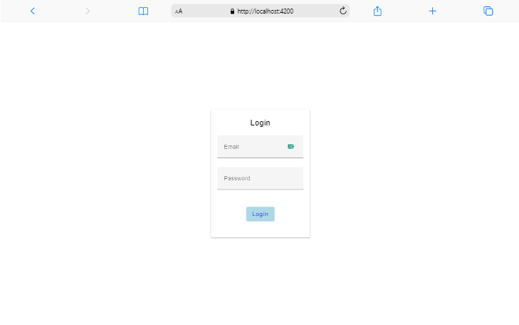
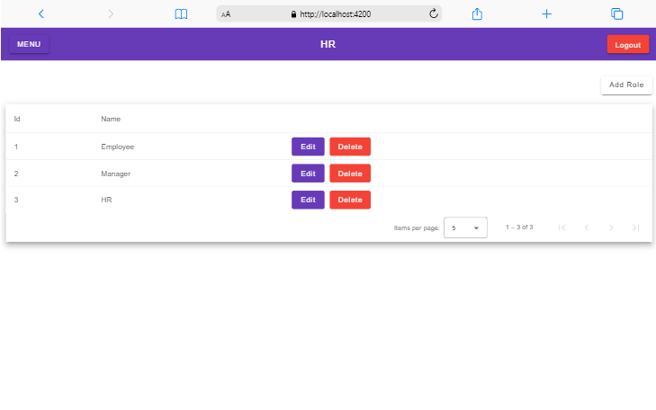
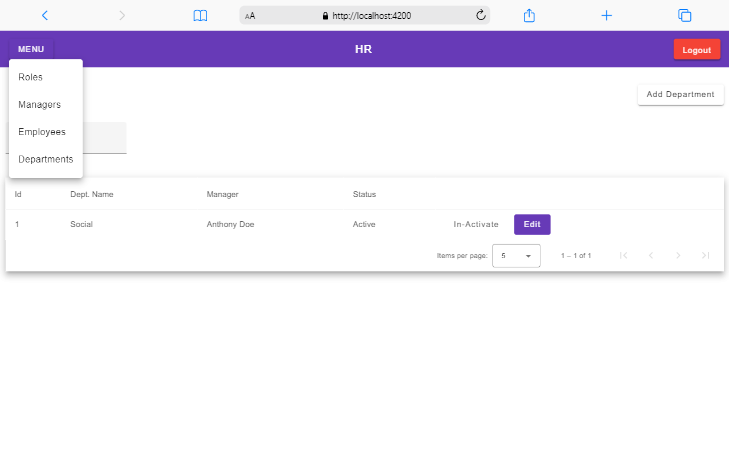
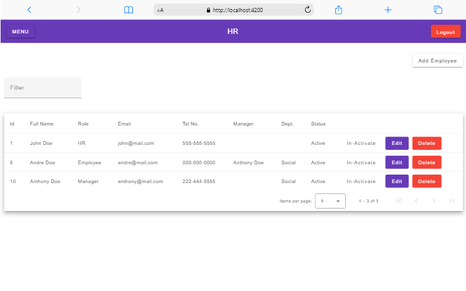

# AngularStack

## Angular with Material UI .NET MSSQL stack 

## Quick Information
**LOGIN DETAILS - Auto generated account as HR**
---
  Email: john@mail.com
  Password: doe100
--
### SCREENSHOTS
 
 

## Description
   This an Angular app with **Ngrx store** for state management. Ngrx store is redux in angular.
   This a crud operation app and with authentication set.
   The server is a .NET app connected with Microsoft SQL Server for database.
   With use some of CQRS architecture for code structuring. 

## Development server
Find the backend in the same folder then Run `dotnet run` on VSCode or use Visual Studio

Run `ng serve` for a dev server. Navigate to `http://localhost:4200/`. The application will automatically reload if you change any of the source files.
